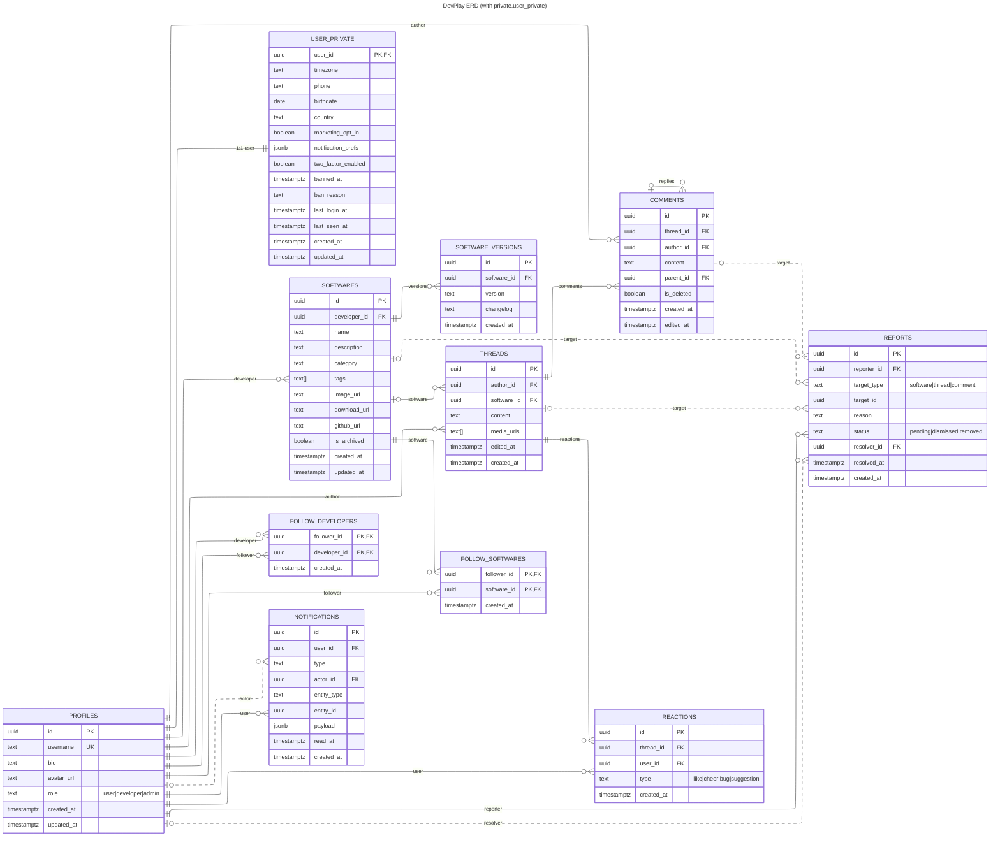

## DevPlay 데이터 모델링 (Supabase + RLS)

본 모델은 Supabase 표준(`auth.users`)을 기준으로 `profiles`를 사용자 메타로 사용합니다. 모든 테이블은 RLS 활성화를 전제로 하며, 정책은 아래에 정의합니다.

---

### 엔터티 개요
- **profiles**: 사용자 공개/역할 정보
- **user_private (private)**: 사용자 민감/운영 정보(PII, 마케팅 동의, 2FA, 밴 상태 등)
- **softwares**: 개발자 소프트웨어 메타
- **software_versions**: 버전 및 변경로그
- **threads**: 소식/일반 글(소프트웨어 연결 가능)
- **comments**: 댓글/대댓글
- **reactions**: 스레드 반응(유니크 토글)
- **follow_developers**, **follow_softwares**: 팔로우 관계
- **notifications**: 사용자 알림
- **reports**: 신고/모더레이션 워크플로우

---

### 스키마 정의(요약 DDL)
```sql
-- profiles
create table if not exists public.profiles (
  id uuid primary key references auth.users(id) on delete cascade,
  username text unique,
  bio text,
  avatar_url text,
  role text not null default 'user' check (role in ('user','developer','admin')),
  created_at timestamptz default now(),
  updated_at timestamptz default now()
);

-- user_private (민감/운영 정보)
create schema if not exists private;
create table if not exists private.user_private (
  user_id uuid primary key references auth.users(id) on delete cascade,
  timezone text default 'UTC',
  phone text,
  birthdate date,
  country text,
  marketing_opt_in boolean not null default false,
  notification_prefs jsonb not null default '{}'::jsonb,
  two_factor_enabled boolean not null default false,
  banned_at timestamptz,
  ban_reason text,
  last_login_at timestamptz,
  last_seen_at timestamptz,
  created_at timestamptz default now(),
  updated_at timestamptz default now()
);

-- updated_at 자동 갱신 트리거
create or replace function private.touch_updated_at()
returns trigger language plpgsql as $$
begin
  new.updated_at = now();
  return new;
end;
$$;

drop trigger if exists trg_user_private_touch on private.user_private;
create trigger trg_user_private_touch
  before update on private.user_private
  for each row execute procedure private.touch_updated_at();

-- softwares
create table if not exists public.softwares (
  id uuid primary key default gen_random_uuid(),
  developer_id uuid not null references public.profiles(id) on delete cascade,
  name text not null,
  description text not null,
  category text not null,
  tags text[] default '{}',
  image_url text,
  download_url text not null,
  github_url text,
  is_archived boolean not null default false,
  created_at timestamptz default now(),
  updated_at timestamptz default now()
);
create index if not exists idx_softwares_dev on public.softwares(developer_id);
create index if not exists idx_softwares_category on public.softwares(category);

-- software_versions
create table if not exists public.software_versions (
  id uuid primary key default gen_random_uuid(),
  software_id uuid not null references public.softwares(id) on delete cascade,
  version text not null,
  changelog text,
  created_at timestamptz default now()
);
create index if not exists idx_versions_software on public.software_versions(software_id, created_at desc);

-- threads
create table if not exists public.threads (
  id uuid primary key default gen_random_uuid(),
  author_id uuid not null references public.profiles(id) on delete cascade,
  software_id uuid references public.softwares(id) on delete set null,
  content text not null,
  media_urls text[] default '{}',
  edited_at timestamptz,
  created_at timestamptz default now()
);
create index if not exists idx_threads_author on public.threads(author_id, created_at desc);
create index if not exists idx_threads_software on public.threads(software_id, created_at desc);

-- comments
create table if not exists public.comments (
  id uuid primary key default gen_random_uuid(),
  thread_id uuid not null references public.threads(id) on delete cascade,
  author_id uuid not null references public.profiles(id) on delete cascade,
  content text not null,
  parent_id uuid references public.comments(id) on delete cascade,
  is_deleted boolean not null default false,
  created_at timestamptz default now(),
  edited_at timestamptz
);
create index if not exists idx_comments_thread on public.comments(thread_id, created_at asc);

-- reactions
create table if not exists public.reactions (
  id uuid primary key default gen_random_uuid(),
  thread_id uuid not null references public.threads(id) on delete cascade,
  user_id uuid not null references public.profiles(id) on delete cascade,
  type text not null check (type in ('like','cheer','bug','suggestion')),
  created_at timestamptz default now(),
  unique(thread_id, user_id, type)
);
create index if not exists idx_reactions_thread on public.reactions(thread_id);

-- follow developers
create table if not exists public.follow_developers (
  follower_id uuid not null references public.profiles(id) on delete cascade,
  developer_id uuid not null references public.profiles(id) on delete cascade,
  created_at timestamptz default now(),
  primary key (follower_id, developer_id)
);

-- follow softwares
create table if not exists public.follow_softwares (
  follower_id uuid not null references public.profiles(id) on delete cascade,
  software_id uuid not null references public.softwares(id) on delete cascade,
  created_at timestamptz default now(),
  primary key (follower_id, software_id)
);

-- notifications
create table if not exists public.notifications (
  id uuid primary key default gen_random_uuid(),
  user_id uuid not null references public.profiles(id) on delete cascade,
  type text not null,
  actor_id uuid references public.profiles(id) on delete set null,
  entity_type text not null,
  entity_id uuid,
  payload jsonb default '{}'::jsonb,
  read_at timestamptz,
  created_at timestamptz default now()
);
create index if not exists idx_notifications_user on public.notifications(user_id, created_at desc);

-- reports
create table if not exists public.reports (
  id uuid primary key default gen_random_uuid(),
  reporter_id uuid not null references public.profiles(id) on delete cascade,
  target_type text not null check (target_type in ('software','thread','comment')),
  target_id uuid not null,
  reason text not null,
  status text not null default 'pending' check (status in ('pending','dismissed','removed')),
  resolver_id uuid references public.profiles(id),
  resolved_at timestamptz,
  created_at timestamptz default now()
);
create index if not exists idx_reports_target on public.reports(target_type, target_id);
```

---

### RLS 정책(요약)
```sql
-- 공통: RLS 활성화
alter table public.profiles enable row level security;
alter table private.user_private enable row level security;
alter table public.softwares enable row level security;
alter table public.software_versions enable row level security;
alter table public.threads enable row level security;
alter table public.comments enable row level security;
alter table public.reactions enable row level security;
alter table public.follow_developers enable row level security;
alter table public.follow_softwares enable row level security;
alter table public.notifications enable row level security;
alter table public.reports enable row level security;

-- 권한 헬퍼 (private 스키마)
create schema if not exists private;
create or replace function private.has_role(target text)
returns boolean language sql security definer set search_path = '' as $$
  select exists (
    select 1 from public.profiles p
    where p.id = (select auth.uid()) and p.role = target
  );
$$;

-- profiles
create policy "Public profiles are viewable by everyone" on public.profiles
  for select using (true);
create policy "Users can update own profile" on public.profiles
  for update to authenticated using ((select auth.uid()) = id) with check ((select auth.uid()) = id);

-- softwares
create policy "Anyone can read softwares" on public.softwares for select using (true);
create policy "Developers can manage own softwares" on public.softwares
  for all to authenticated using (
    (select auth.uid()) = developer_id and private.has_role('developer')
  ) with check (
    (select auth.uid()) = developer_id and private.has_role('developer')
  );

-- software_versions (소유자만 쓰기)
create policy "Anyone can read versions" on public.software_versions for select using (true);
create policy "Owner can write versions" on public.software_versions
  for all to authenticated using (
    exists(select 1 from public.softwares s where s.id = software_id and s.developer_id = (select auth.uid()))
  ) with check (
    exists(select 1 from public.softwares s where s.id = software_id and s.developer_id = (select auth.uid()))
  );

-- threads
create policy "Anyone can read threads" on public.threads for select using (true);
create policy "Author can write threads" on public.threads
  for all to authenticated using ((select auth.uid()) = author_id)
  with check ((select auth.uid()) = author_id);

-- comments
create policy "Anyone can read comments" on public.comments for select using (true);
create policy "Author can write comments" on public.comments
  for all to authenticated using ((select auth.uid()) = author_id)
  with check ((select auth.uid()) = author_id);

-- reactions
create policy "Anyone can read reactions" on public.reactions for select using (true);
create policy "Owner can write reactions" on public.reactions
  for all to authenticated using ((select auth.uid()) = user_id)
  with check ((select auth.uid()) = user_id);

-- follows
create policy "Owner can manage follow_developers" on public.follow_developers
  for all to authenticated using ((select auth.uid()) = follower_id)
  with check ((select auth.uid()) = follower_id);
create policy "Owner can manage follow_softwares" on public.follow_softwares
  for all to authenticated using ((select auth.uid()) = follower_id)
  with check ((select auth.uid()) = follower_id);

-- notifications (본인만 조회)
create policy "Owner can read notifications" on public.notifications
  for select to authenticated using ((select auth.uid()) = user_id);
create policy "System/admin can insert notifications" on public.notifications
  for insert to authenticated with check (
    private.has_role('admin') or ( (select auth.uid()) = user_id )
  );

-- reports (작성자/관리자)
create policy "Reporter can write, anyone can read minimized" on public.reports
  for select using (true);
create policy "Reporter can create" on public.reports
  for insert to authenticated with check ((select auth.uid()) = reporter_id);
create policy "Admin can resolve" on public.reports
  for update to authenticated using ( private.has_role('admin') );

-- user_private (본인/관리자)
create policy "Owner/admin can read private user data" on private.user_private
  for select to authenticated using (
    (select auth.uid()) = user_id or private.has_role('admin')
  );

create policy "Owner/admin can update private user data" on private.user_private
  for update to authenticated using (
    (select auth.uid()) = user_id or private.has_role('admin')
  ) with check (
    (select auth.uid()) = user_id or private.has_role('admin')
  );

create policy "System/admin or owner can insert private row" on private.user_private
  for insert to authenticated with check (
    private.has_role('admin') or (select auth.uid()) = user_id
  );

-- 가입 시 자동 생성 트리거
create or replace function private.handle_new_user_private()
returns trigger language plpgsql security definer set search_path = '' as $$
begin
  insert into private.user_private (user_id) values (new.id)
  on conflict (user_id) do nothing;
  return new;
end;
$$;

drop trigger if exists on_auth_user_created_user_private on auth.users;
create trigger on_auth_user_created_user_private
  after insert on auth.users
  for each row execute procedure private.handle_new_user_private();
```

---

### 스토리지 버킷 및 정책
- 버킷: `avatars`, `software`, `threads`
```sql
insert into storage.buckets (id, name) values
  ('avatars','avatars') on conflict do nothing,
  ('software','software') on conflict do nothing,
  ('threads','threads') on conflict do nothing;

-- 아바타 공개 조회 허용, 본인 업로드 가능
create policy "Avatar images are publicly accessible." on storage.objects for select using (bucket_id = 'avatars');
create policy "Anyone can upload an avatar." on storage.objects for insert with check (bucket_id = 'avatars' and (select auth.uid()) is not null);

-- 소프트웨어/스레드 미디어는 소유자만 업로드/삭제, 공개 열람은 컨텐츠에 한정(필요 시 private로 운영)
create policy "Public read software media" on storage.objects for select using (bucket_id = 'software');
create policy "Owner write software media" on storage.objects for all to authenticated using (
  bucket_id = 'software' and owner = (select auth.uid())
) with check (
  bucket_id = 'software' and owner = (select auth.uid())
);
```

---

### 인덱스/성능 가이드
- 외래키 컬럼 인덱스 필수(`*_id`)
- 피드/탐색: `created_at desc` 복합 인덱스, 카테고리/태그 인덱스
- RLS 조건 컬럼(`author_id`, `developer_id`, `user_id`) 인덱스
- 페이지네이션: 키셋(커서) 우선, 필요 시 오프셋

---

### 파생 뷰(선택)
- `popular_threads_7d`: 최근 7일 반응/댓글 가중 점수로 정렬하는 뷰/머티리얼라이즈드 뷰
- `me_profile`: 본인 전용(세션) 공개+민감 정보 병합 뷰

```sql
-- 본인 전용 조인 뷰 (Postgres 15+ 권장: security_invoker)
create or replace view public.me_profile as
  select
    p.id,
    p.username,
    p.bio,
    p.avatar_url,
    p.role,
    up.timezone,
    up.notification_prefs,
    up.two_factor_enabled,
    up.last_seen_at
  from public.profiles p
  join private.user_private up on up.user_id = p.id
  where p.id = (select auth.uid());

alter view public.me_profile set (security_invoker = true);
```

---

### ERD (Mermaid)




